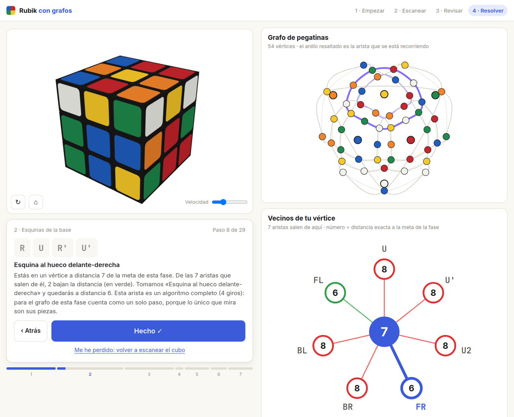

# 🧊 Rubik con grafos

A web app that walks you through solving a Rubik's cube **step by step, as a path in a graph**,
and shows you the graph theory behind every move. You scan the cube with your phone or laptop
camera (or upload two photos), confirm each move as you make it, and watch the path unfold.

   

<p align="center"></p>

## ✨ Features

- **Camera or photo input.** Two pictures, each showing three faces with a corner pointing at the
  camera. Seven draggable handles fit the hexagonal silhouette, a per-face homography maps the
  3×3 grids (perspective included), and the 54 samples are clustered around the six centre
  colours with a balanced assignment (9 stickers per colour). If the result is an impossible cube,
  the most doubtful stickers are swapped until it is valid (this catches the usual red/orange mix-ups).
  Manual painting and a random demo cube are also available.
- **Two ways to solve:**
  - **Learning mode (layer by layer).** 7 stages; each stage is a small explicit graph (the white
    cross has 190,080 vertices) whose edges are single turns or whole algorithms (macro-operators).
    A backwards BFS from the goal gives the exact distance of every vertex, and each step follows an
    edge that lowers it by one. ~100–140 turns.
  - **Fast mode (Kociemba two-phase).** IDA* in the quotient graph G/H, then in the subgroup
    H = ⟨U, D, R2, L2, F2, B2⟩, with pattern databases as admissible heuristics. ~20–22 turns,
    pure Python, usually well under a second.
- **Guided, confirmed steps.** Every step is animated on a 3D cube (three.js) and waits for you to
  press *Hecho*. If you get lost, rescan the cube and a new path is computed from wherever you are.
- **Graph views at every step:**
  - the **sticker graph**: 54 facelets as vertices, each face turn drawn as the ring it rotates;
  - the **neighbourhood** of your current vertex, every edge coloured by the distance (or lower bound) it leads to;
  - the **BFS layers** of the stage graph (or the pattern database) with your position;
  - the **path** so far.
- **Login gate (optional).** A username/password form with a signed session cookie, credentials
  read from the environment (a Secret on the cluster), plus a lockout after repeated failures.
  Leave it unset and the app runs open, which is what you want on `localhost`.
- **LLM tutor (optional).** Any OpenAI-compatible endpoint (vLLM, Ollama…) answers questions about
  the current step. The app works fully without it.

## 🚀 Quick Start

### Local development

```bash
python -m venv .venv && . .venv/bin/activate
pip install -r requirements.txt
cp .env.example .env         # optional: set VLLM_ENDPOINT to enable the tutor
set -a; . ./.env; set +a
python app.py                # http://localhost:5000
```

The first run builds the solver tables into `tables/` (~5 s); later runs load them.
The camera needs a secure context: `localhost` or HTTPS.

Tests:

```bash
pip install pytest && python -m pytest -q
```

### Container (Podman / Docker)

```bash
podman build -t rubik-solver .
podman run -d --name rubik-solver -p 8080:8080 \
  -e VLLM_ENDPOINT=http://your-llm-host:8000/v1 \
  -e VLLM_MODEL=qwen32b \
  rubik-solver
```

Open http://localhost:8080. The tables are built at image build time, so the container starts instantly.

### OpenShift (Kustomize)

```bash
# 1. Project + binary build from source
oc new-project rubik-solver
oc new-build --name=rubik-solver --binary --strategy=docker
oc start-build rubik-solver --from-dir=. --follow

# 2. Site-specific settings (kept out of git; all optional)
oc create configmap rubik-solver-config \
  --from-literal=VLLM_ENDPOINT=http://your-llm-host:8000/v1 \
  --from-literal=SITE_DOMAIN=rubik-solver.your-cluster.example.com
oc create secret generic rubik-solver-llm --from-literal=VLLM_API_KEY=...

# Login (skip it and the app is open to anyone who can reach the route)
HASH=$(python -c "from werkzeug.security import generate_password_hash as g; print(g('your-password'))")
oc create secret generic rubik-solver-auth \
  --from-literal=AUTH_USER=you --from-literal=AUTH_PASSWORD_HASH="$HASH"
#   more accounts: --from-literal=AUTH_USERS="ana:<hash>,luis:<hash>"

# 3. Deploy, then create the Route with your own host
oc apply -k k8s/overlays/openshift/
cp k8s/overlays/openshift/route.local.yaml.example k8s/overlays/openshift/route.local.yaml
#   edit the host, then:
oc apply -f k8s/overlays/openshift/route.local.yaml
```

Rebuild after code changes:

```bash
oc start-build rubik-solver --from-dir=. --follow
oc rollout restart deployment/rubik-solver
```

### Kubernetes (Kustomize)

```bash
docker build -t your-registry/rubik-solver:latest . && docker push your-registry/rubik-solver:latest
# edit k8s/overlays/kubernetes/ (image, ingress host); create the optional configmap/secret as above
kubectl create namespace rubik-solver
kubectl apply -k k8s/overlays/kubernetes/
```

## 🔧 Configuration

| Variable | Default | Description |
|---|---|---|
| `AUTH_USER` | _(empty)_ | Username for the login form. Empty = any username |
| `AUTH_PASSWORD_HASH` | _(empty)_ | Password hash (`werkzeug.security.generate_password_hash`) |
| `AUTH_PASSWORD` | _(empty)_ | Plain password, if you prefer it to the hash. Both empty = no login |
| `AUTH_USERS` | _(empty)_ | More accounts: `ana:<hash>,luis:<hash>` (a value that is not a hash is taken as a plain password) |
| `AUTH_SESSION_DAYS` | `30` | How long a session lasts |
| `SECRET_KEY` | _(derived)_ | Signs the session cookie; derived from the credentials when unset |
| `COOKIE_SECURE` | `1` | Set to `0` only when serving over plain http |
| `VLLM_ENDPOINT` | _(empty)_ | OpenAI-compatible API URL for the tutor. Empty = tutor off |
| `VLLM_MODEL` | `qwen32b` | Model name |
| `VLLM_API_KEY` | _(empty)_ | Bearer token, if the endpoint needs one |
| `VLLM_TIMEOUT` | `60` | Seconds to wait for the tutor |
| `SOLVE_SECONDS` | `2.5` | Search budget of the fast solver |
| `SITE_DOMAIN` | _(empty)_ | Optional hostname shown in the footer |
| `TABLE_DIR` | `./tables` | Where the solver tables are cached (`/app/tables` in the image) |
| `PORT` | `5000` | Dev server port (gunicorn listens on 8080 in the image) |

Real hostnames, internal IPs and keys never go in git: use `.env` locally, and a ConfigMap/Secret
plus the gitignored `route.local.yaml` on the cluster.

## 🧠 How the solver maps to graph theory

| Idea | Where |
|---|---|
| State graph = Cayley graph of the cube group (≈4.3·10¹⁹ vertices, 18 edges each, diameter 20) | both modes |
| Sticker graph = action of the face turns on the 54 facelets (cycles of a permutation) | `cube/model.py` → `ring_cycles` |
| Projection onto a few pieces → small stage graph; macro-operators as edges | `cube/stages.py` |
| Backwards BFS from the goal → exact distance; greedy descent = shortest path | `Stage.build`, `Stage.solve` |
| Quotient graph G/H and subgroup H; IDA* with pattern databases (admissible lower bounds) | `cube/twophase.py` |

## 📁 Project structure

```
├── app.py                   # Flask app + JSON API
├── auth.py                  # optional login gate
├── cube/
│   ├── model.py             # facelets/cubies, moves derived from 3D geometry, validation
│   ├── twophase.py          # Kociemba two-phase, instrumented for explanations
│   ├── stages.py            # layer-by-layer stages as BFS-solved graphs
│   └── tutor.py             # optional LLM tutor
├── templates/index.html
├── static/
│   ├── css/app.css
│   └── js/                  # app.js, capture.js, cube3d.js, graphs.js, cubemodel.js
├── templates/login.html
├── tests/                   # pytest
├── Dockerfile
└── k8s/                     # Kustomize base + openshift / kubernetes overlays
```

## 📄 License

MIT
